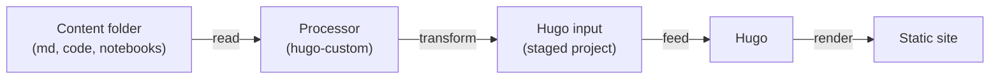

# Hugo Custom

## What Problem This Solves?

Let's say you have a folder with your notes, *.md*, code, etc, and you would like to put all of that in a website where references across the content work, and it can be deployed, so anyone can read it. This is one of the applications of static site generators. I'm using [Hugo](https://github.com/gohugoio/hugo) SSG. 

The idea is take a folder with content (.md, code files, video, etc) and turn it into a static web site, with the following features: 
  
  - Each code file has its own page, so they are treated like .md files. 
  - References between files work on the site.
  - Videos can be played.
  - Inside the folder, gitignores are considered.
  - Offline after all the assets are downloaded.
  - Avoid extra code for plugins, use Hugo ecosystem.
  - Collapsible sidebar tree with auto-expanded active branch.
  - Right-side table of contents that highlights the section you're reading.
  - Light/dark theme toggle that remembers your choice. 

To achieve this the idea is that a processor read the content folder passed to it, transform it into something ready as input for Hugo, and feed it to Hugo, Hugo output is the site.



## AI Generated Section

At this moment, the code is AI generated, seems to work, but I have to review it at some moment.

### What It Is?

A generic Hugo pipeline that turns **a folder of Markdown, notebooks and code** into a fully self-contained static website: staged Hugo project,
rendered site, vendored KaTeX, local fonts, per-extension file icons, tags
page, per-project OG images, search and code views for every source file.

The tooling is a Python package (`hugo-custom`) installed and run through
`uv`. A content repo only needs a `hugo_custom_site.toml` — no Hugo
configuration is developed inside the content repo; the pipeline generates a
complete Hugo project (content, layouts, static assets, `hugo.toml`) in the
`stage` directory and renders it with Hugo.

### Requirements

- [uv](https://docs.astral.sh/uv/)
- [Hugo](https://gohugo.io/installation/) (extended edition, 0.165+)
- [Node.js](https://nodejs.org/) and [pnpm](https://pnpm.io/) (to compile the
  TypeScript site scripts — see [Development](#development))
- git

### Quick start

#### 1. Add `hugo_custom_site.toml` to your repo root

The tool locates this file automatically by walking up from the current
directory, so it must sit at the top of the repo:

```toml
title = "My Articles"
site-url = "https://yourname.github.io/myarticles/"
source = "self"           # folder with the content
stage = "hugo_src"        # generated Hugo project (add to .gitignore)
output = "site"           # rendered site (add to .gitignore)
# brand = "MY ARTICLES"   # text on the OG images (default: TITLE uppercased)
# siteignore = ".siteignore"  # optional, see "Deploy-only exclusions"
```

The site title/URL and every visual or behavior option live here. See
[Configuration](#configuration) for the full reference.

#### 2. Ignore the generated output

Add this to the repo `.gitignore` — the stage and output dirs are fully
regenerated on every build:

```gitignore
# hugo-custom generated output
/hugo_src/     # staged Hugo project (the `stage` dir)
/site/         # rendered site (the `output` dir)
```

Use the actual `stage`/`output` values from `hugo_custom_site.toml` if you
changed them. Keep `hugo_custom_site.toml` and `siteignore` committed —
they are configuration. Since the pipeline uses this `.gitignore` to decide
what gets published from `source/`, these entries double as build-noise
exclusions.

#### 3. Preview locally

```bash
cd /path/to/content-repo
uvx --from /path/to/hugo_custom hugo-custom --preview
# or from GitHub:
# uvx --from git+https://github.com/BritoAlv/hugo_custom.git@main hugo-custom --preview
```

This stages the site and starts Hugo's dev server with hot reload
(Ctrl-C to stop). Open the printed URL.

To test from a phone or another device on the same network, bind the
server to your LAN and open the printed address:

```bash
hugo-custom --preview --host 0.0.0.0
# On your phone (same WiFi), open: http://<lan-ip>:1313/
```

Passing your LAN IP directly works too (`--host 192.168.1.50`). The
`--host` flag is forwarded to Hugo's `--bind`, and live-reload's baseURL
follows the address. The default is `127.0.0.1` (localhost only).

#### 4. Build for production locally

```bash
cd /path/to/content-repo
uvx --from /path/to/hugo_custom hugo-custom --deploy
# or from GitHub:
# uvx --from git+https://github.com/BritoAlv/hugo_custom.git@main hugo-custom --deploy
```

Deploy mode is stricter: it applies `.siteignore` exclusions.

#### Offline use

Everything works without network after an initial warm-up run:

- The `uvx --from /path/to/hugo_custom` build itself never touches the
  network (only `--from git+...` does).
- Vendored assets (KaTeX, Lato fonts, file icons) are downloaded on first
  build and cached in `~/.cache/hugo_custom` (see
  [Caching](#caching)); later builds reuse the cache.
- `uv` caches the package build too, so the second run is fully offline.

#### 5. Deploy on GitHub Pages

1. In your repo: **Settings → Pages → Source: GitHub Actions**.
2. Add `.github/workflows/deploy.yml` to your content repo:

```yaml
name: Deploy to GitHub Pages

on:
  push:
    branches: [main]

permissions:
  contents: read
  pages: write
  id-token: write

concurrency:
  group: pages
  cancel-in-progress: true

jobs:
  deploy:
    uses: BritoAlv/hugo_custom/.github/workflows/deploy-pages.yml@main
    # config: hugo_custom_site.toml   # only needed if renamed/moved
```

3. Push. The reusable workflow installs Hugo + uv, runs the deploy build via
   `uvx`, and uploads `site/` to Pages.

### Configuration

`hugo_custom_site.toml` — all keys optional unless noted:

| Key | Default | Meaning |
|---|---|---|
| `title` | repo directory name | Site title (used in the navbar, `<title>`, index page) |
| `site-url` | `""` | Canonical URL, required for OG images to be absolute |
| `brand` | `title` uppercased | Text drawn on the generated OG images |
| `source` | `self` | Folder with the content (relative to repo root; `.` = the repo itself) |
| `stage` | `hugo_src` | Generated Hugo project (add to `.gitignore`) |
| `output` | `site` | Rendered site (add to `.gitignore`) |
| `siteignore` | none | Path to a deploy-only ignore file (see below) |
| `ignore` | `[]` | Always-applied exclusion patterns (gitignore syntax) |
| `cache-dir` | `$XDG_CACHE_HOME/hugo_custom` | Where vendored assets are cached |
| `homepage` | none | Source file rendered on the site's index page (see below) |
| `[params]` | none | Extra keys merged into the Hugo `params` section |

The built-in template (`src/hugo_custom/templates/hugo.toml`) provides the
baseline: pretty URLs, tags taxonomy, search index (`/index.json`), KaTeX
math via the goldmark passthrough extension, Chroma syntax highlighting and
the light/dark CSS theme.

Example overrides:

```toml
[params]
description = "My site"
```

`cache-dir` also honors the `HUGO_CUSTOM_CACHE` environment variable.

### Homepage

By default the index page shows a warning asking for a homepage file. Set
`homepage` to the path of a file under `source/` to render it instead:

```toml
homepage = "README.md"
```

The file is rendered in its own page context (relative links, heading IDs
and the right-side table of contents all work). If the file is missing, a
warning is shown on the index page and at build time.

### Navigation and theme

These are built into the generated template (`templates/static/css` and
`templates/static/ts`), no configuration needed. The site scripts are written
in TypeScript and compiled to `static/js/` by `tsc` (latest TypeScript,
fetched with `pnpm dlx` and cached in pnpm's store after the first run) as
part of the stage step:

- **Sidebar tree** — the site structure is shown as a collapsible tree with
  SVG arrows and rounded connector lines. Folders stay collapsed/expanded
  across visits (`localStorage`), and the branch of the current page opens
  automatically.
- **Right table of contents** — pages with headings get a sticky TOC rail
  on wide screens (the same contents appear as a collapsible box on mobile).
  As you scroll, the current section is highlighted and kept in view
  (`toc.js`, IntersectionObserver). Nested headings are indented with the
  same tree shapes as the sidebar. TOC depth follows Hugo's
  `[markup.tableOfContents]` setting (default h2–h6).
- **Theme toggle** — the sun/moon button in the header switches between
  light and dark; your choice is remembered (`localStorage`, key
  `hugo-custom-theme`). Without a saved choice the OS preference is used.
  Code highlighting follows the theme via a scoped Chroma stylesheet
  generated at build time.

### Content conventions

The pipeline treats the folder tree under `source/` as the site structure:

- **Markdown** (`.md`): rendered as pages. Tags come from front matter or
  `## Keywords` sections (see [Tags](#tags) below). Dates are taken from git
  history (`date` from the first commit, `lastmod` from the last). Front
  matter is preserved and enriched; the first H1 becomes the page title.
- **Jupyter notebooks** (`.ipynb`): converted to static Markdown pages —
  markdown cells pass through, code cells become highlighted blocks and the
  stored outputs (text/images) are kept as-is. Notebooks are **not**
  executed.
- **Code files** (`.rs`, `.py`, `.toml`, `.sh`, `.js`, …): a `codeview/`
  page is generated for each, showing the file with syntax highlighting and a
  download link; markdown links to code files are rewritten to point at their
  codeview page.
- **Other files** (images, videos, audio, PDFs, data…): copied verbatim and
  served as-is. Those with a browser-embeddable preview (images, videos,
  audio, PDFs, CSV and text data) get a `preview/` page that embeds the file
  inline with a download link; markdown links and sidebar entries point at the
  preview page, and the raw file stays available for download.

#### Tags

Tags are **never generated automatically** — only dates and titles are
derived from the content; tags are always yours to write. Pages with tags
show them in a "Keywords:" block under the title, appear on the `/tags/`
page (grouped by tag) and are searchable by tag. There are two authoring
mechanisms:

**1. `## Keywords` section (markdown only).** A heading at level 2–4 named
`Keywords` (optionally with a trailing period or colon), followed by a bullet
list — each bullet becomes a tag:

```markdown
## Keywords

- hugo
- static site
- python
```

The heading may also be written as `### Keywords:`. Bullets keep their
capitalization but are slugified for the tag URL (`static site` →
`/tags/static-site/`).

**2. Front matter.** Add a `tags` list to the YAML front matter of a page.
`categories` and `keywords` are accepted as aliases:

```markdown
---
title: My page
tags: [hugo, static-site]
---

# My page
```

**Notebooks** only support front matter: put `tags` (or `categories`) in the
notebook's `metadata` (e.g. `"metadata": {"tags": ["analysis"]}`). Notebook
markdown cells are **not** scanned for `## Keywords`.

Both mechanisms can be combined: front matter tags and `## Keywords` bullets
are merged. See `examples/references/notes/` and
`examples/references/notebooks/` for live examples of each.

Exclusions:

- Files ignored by your repo's `.gitignore` (root and nested) are never
  published.
- The `ignore` key in `hugo_custom_site.toml` adds always-applied patterns
  (gitignore syntax, relative to the repo root), e.g.
  `ignore = [".github/", "docs/secret/"]`.
- A `siteignore` file lists paths excluded **only on deploy** — useful for
  marking content "not ready yet" while keeping it in the repo and in local
  previews:

  ```
  source/wip_project/
  source/rough_draft.md
  ```

  (Use paths relative to the repo root, e.g. `self/async_rust/`.)

### References between files

Links across markdown, notebooks and code files work out of the box: a
custom render hook (`layouts/_default/_markup/render-link.html`) rewrites
every markdown link at build time. Write a normal markdown link with the
**real file path relative to the current file's folder, extension included**:

```markdown
[see setup](setup.md)              # same folder      -> /notes/setup/
[deep page](deep/subpage.md)       # subfolder        -> /notes/deep/subpage/
[anchor](setup.md#requirements)    # anchor preserved -> /notes/setup/#requirements
[notebook](../notebooks/a.ipynb)   # notebook page    -> /notebooks/a.ipynb/
[source](../code/main.py)          # code file        -> /codeview/code/main.py/
[diagram](../../assets/fig.svg)    # raw asset        -> /preview/assets/fig.svg/ (embedded)
```

Rules:

- `.md` and `.ipynb` links are rewritten to the target page's permalink
  (`#fragments` and `?queries` are preserved).
- Code files (`.rs`, `.py`, `.toml`, `.sh`, `.bash`, `.js`, `.ts`, `.jsx`,
  `.tsx`, `.json`, `.yml`, `.yaml`, `.c`, `.h`, `.cpp`, `.hpp`, `.java`,
  `.go`, `.rb`, `.txt`, `.ini`, `.cfg`, `.sql`, `.html`, `.css`, `.lock`)
  are rewritten to their `codeview/` page.
- Other files (images, videos, audio, PDFs, CSV/text data…) are copied
  verbatim and served as-is. Those with a browser-embeddable preview get a
  `preview/` page that embeds the file inline with a download link, and their
  links are rewritten to it (see the examples). Anything else (archives, …)
  is linked directly to the raw file.
- `http(s)://`, `mailto:`, `#anchor` and `/absolute` links pass through
  unchanged; external links get `rel="noopener"`.

`examples/references/` in this repo is a working demo of every case above.

### Testing (this repo)

This repository is its own test bed: it publishes itself to
[britoalv.github.io/hugo_custom/](https://britoalv.github.io/hugo_custom/).

- `hugo_custom_site.toml` sets `source = "."` — the pipeline builds a site
  from the repo's own files, exercising code views, file icons, OG images,
  the sidebar tree and generated pages.
- `examples/references/` is normal repo content, published as the
  `examples/references/` section — it doubles as the live demo of
  [references between files](#references-between-files).
- `.siteignore` demonstrates deploy-only exclusions: `examples/wip/` shows in
  local previews but is left out of the deployed site.
- `examples/.gitignore` demonstrates nested gitignore exclusions: the
  `examples/scratch/` folder is committed (force-added) but never published,
  in previews or deploys.
- `.github/workflows/deploy.yml` deploys to Pages using the reusable workflow
  with `package: .`, so the deployed site is built from the exact commit that
  triggered it (dogfooding).

### What the pipeline does

1. **Collect** — walk `source/`, apply ignore specs (`.gitignore` +
   nested + `siteignore` on deploy).
2. **Stage** — build `stage/` (`hugo_src/`): processed markdown and
   notebook pages in `content/`, `codeview/` pages, raw files in `static/`,
   generated `data/sidebar.yml` (the sidebar tree), `hugo.toml` and the
   layout/asset templates (the TypeScript site scripts are compiled to
   `static/js/` with `tsc` here).
3. **Render** — `hugo --source hugo_src --destination site`.
4. **Vendor** — pinned KaTeX and Lato fonts and the file icons are copied
   into `static/vendor/` and `static/icons/` during staging, so the built
   site is fully self-contained (no CDN references).

Vendored assets (KaTeX tarball, Google Fonts woff2, vscode-icons SVGs) are
downloaded on first use and cached, so builds are fast and work offline after
the first run.

### Caching

Vendored assets live in `$XDG_CACHE_HOME/hugo_custom` (default
`~/.cache/hugo_custom`), overridable per site with `cache-dir` in
`hugo_custom_site.toml` or globally with the `HUGO_CUSTOM_CACHE`
environment variable.
To share a warm cache across machines (CI, new laptop), copy that directory
or point both at a shared location.

### Development

Iterate locally with `uv run` — it always rebuilds from the current source
(`uvx --from .` caches by name+version, so after code changes it needs a
version bump or `uv cache clean`):

```bash
uv sync
uv run hugo-custom --help
uv run hugo-custom          # build this repo's own site from its files
```

The site scripts in `src/hugo_custom/templates/static/ts/` are compiled at
stage time. To get TypeScript IntelliSense and type-checking in your editor,
install the pinned compiler once:

```bash
pnpm install
pnpm run build:js          # optional: compile to templates/static/js/ by hand
```

VSCode uses the native TypeScript 7 language service when
`"js/ts.experimental.useTsgo": true` is set (already done via
`.vscode/settings.json`). When running `hugo-custom` from an installed copy
(via `uvx`), the compiler is fetched on demand with `pnpm dlx`, which
resolves the latest TypeScript release; the pnpm store caches it, so builds
work offline after the first run.

Test against any content repo without installing anything:

```bash
uv run hugo-custom --config /path/to/content/hugo_custom_site.toml --preview
```

And use a `file:` dependency
(`uv add hugo-custom@file:///path/to/hugo_custom`) if you prefer a
lockfile-based workflow in the content repo.