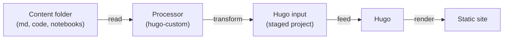
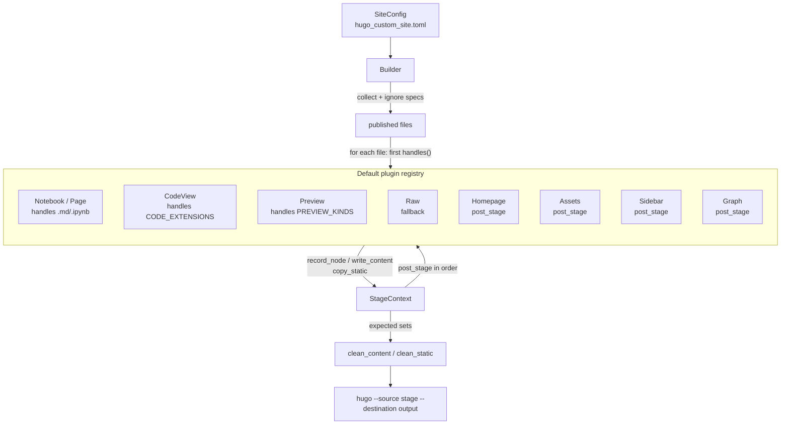

# Hugo Custom

## Not Ready to Use due to AI Code.

## What Problem This Solves?

Let's say you have a folder with your notes, *.md*, code, etc, and you would like to put all of that in a website where references across the content work, and it can be deployed, so anyone can read it. This is one of the applications of static site generators. I'm using [Hugo](https://github.com/gohugoio/hugo) SSG. 

The idea is take a folder with content (.md, code files, video, etc) and turn it into a static web site, with the following features: 
  
  - Each supported file (*.csv*, *.mp4*, *.md*, *.rust*, etc) has its own page, so they are treated like .md files. 
  - References between files work on the site.
  - Inside the folder, gitignores are considered.
  - Offline after all the assets are downloaded.
  - Right-side table of contents that highlights the section you're reading.
  - Obsidian-style graph page showing how content references each other. 
  - Git metadata on pages (last commit hash, author and date) when the content is tracked by git. 

To achieve those features, the idea is that a processor read the content folder passed to it, transform it into something ready as input for Hugo, and feed it to Hugo, Hugo output is the site.



## AI Generated Section

At this moment, the code is AI generated, seems to work, but I have to review it at some moment. The pipeline is deliberately structured as a **plugin architecture** — every feature (pages, code views, graph, sidebar, assets, …) is a self-contained plugin with a uniform contract and a shared `StageContext` registry. The global helpers that multiple plugins need live in `utils/`; everything plugin-specific lives inside the plugin itself. See [Architecture](#architecture) for the full design and how to add a new plugin.

### What It Is?

A generic Hugo pipeline that turns **a folder of Markdown, notebooks and code** into a fully self-contained static website: staged Hugo project,
rendered site, vendored KaTeX, Mermaid, ECharts, local fonts, per-extension file icons, tags
page, per-project OG images, search and code views for every source file.

The tooling is a Python package (`hugo-custom`) installed and run through
`uv`. A content repo only needs a `hugo_custom_site.toml` — no Hugo
configuration is developed inside the content repo; the pipeline generates a
complete Hugo project (content, layouts, static assets, `hugo.toml`) in the
`stage` directory and renders it with Hugo.

### Requirements

- [uv](https://docs.astral.sh/uv/) (recommended; `pip`/`pipx` also work — `uv` is only required for the reusable GitHub workflow)
- [Hugo](https://gohugo.io/installation/) 0.165+ (extended edition recommended; current templates use `hugo gen chromastyles` and no SCSS pipeline, so vanilla Hugo also builds)
- [Node.js](https://nodejs.org/) + [pnpm](https://pnpm.io/) 11+ (optional but recommended to compile the TypeScript site scripts — see [Development](#development); `tsc` on `PATH` also works, and `pnpm dlx --package=typescript tsc` is used as fallback)
- git (optional; without it dates fall back to filesystem `mtime` and commit metadata is omitted — the site still builds)

### Quick start

#### 1. Add `hugo_custom_site.toml` to your repo root

The tool locates this file automatically by walking up from the current
directory, so it normally sits at the top of the repo (override with `--config`):

```toml
title = "My Articles"
site-url = "https://yourname.github.io/myarticles/"
source = "."             # folder with the content (relative to repo root; "." = repo itself, default)
stage = "hugo_src"       # generated Hugo project (add to .gitignore)
output = "site"          # rendered site (add to .gitignore)
# brand = "MY ARTICLES"  # text on the OG images (default: title uppercased)
# siteignore = ".siteignore"  # optional, see "Deploy-only exclusions"
```

The site title/URL and every visual or behavior option live here. See
[Configuration](#configuration) for the full reference.

#### 2. Ignore the generated output

Add this to the repo `.gitignore` — the stage and output dirs are fully
regenerated on every build:

```gitignore
# hugo-custom generated output
/hugo_src/     # staged Hugo project (the `stage` dir)
/site/         # rendered site (the `output` dir)
```

Use the actual `stage`/`output` values from `hugo_custom_site.toml` if you
changed them. Keep `hugo_custom_site.toml` and `siteignore` committed —
they are configuration.

> When `source = "."` (the common dogfooding case), `stage`/`output` live
> *inside* the source tree. The `/.hugo_src/` and `/site/` patterns above
> are what prevent them from being re-collected as content via the repo's
> `.gitignore` + `siteignore` specs. If you set `source` to a subdirectory
> (e.g. `source = "content"`), make sure `stage`/`output` are outside that
> subdirectory or add matching ignore entries for that base.

#### 3. Preview locally

```bash
cd /path/to/content-repo
uvx --from /path/to/hugo_custom hugo-custom --preview
# or from GitHub:
# uvx --from git+https://github.com/BritoAlv/hugo_custom.git@main hugo-custom --preview
```

This stages the site and starts Hugo's dev server with hot reload
(Ctrl-C to stop). Open the printed URL. Other useful flags:

- `--config hugo_custom_site.toml` / `-c` — point at a config outside the repo root
- `--stage-only` — only build `stage/` without calling `hugo`
- `--deploy` — apply `.siteignore` exclusions locally

To test from a phone or another device on the same network, bind the
server to your LAN and open the printed address:

```bash
hugo-custom --preview --host 0.0.0.0
# On your phone (same WiFi), open: http://<lan-ip>:1313/
```

Passing your LAN IP directly works too (`--host 192.168.1.50`). The
`--host` flag is forwarded to Hugo's `--bind` on fixed port `1313`; when
`--host` is not `127.0.0.1`/`localhost` the server's `--baseURL` is set to
`http://<host>:1313` so live-reload works. When `--host` is `0.0.0.0` the
tool also prints `http://<lan-ip>:1313/` (via `utils/network.py`). The
default is `127.0.0.1` (localhost only).

#### 4. Build for production locally

```bash
cd /path/to/content-repo
uvx --from /path/to/hugo_custom hugo-custom --deploy
# or from GitHub:
# uvx --from git+https://github.com/BritoAlv/hugo_custom.git@main hugo-custom --deploy
```

Deploy mode is stricter: it applies `.siteignore` exclusions (also triggered by `HUGO_DEPLOY=true` in CI).

#### Offline use

Everything works without network after an initial warm-up run:

- The `uvx --from /path/to/hugo_custom` build itself never touches the
  network (only `--from git+...` does).
- Vendored assets (KaTeX, Mermaid, ECharts, Lato fonts, file icons) are downloaded on first
  build and cached in `~/.cache/hugo_custom/vendor` (see
  [Caching](#caching)); later builds reuse the cache.
- `uv` caches the package build too, so the second run is fully offline.

#### 5. Deploy on GitHub Pages

1. In your repo: **Settings → Pages → Source: GitHub Actions**.
2. Add `.github/workflows/deploy.yml` to your content repo:

```yaml
name: Deploy to GitHub Pages

on:
  push:
    branches: [main]

permissions:
  contents: read
  pages: write
  id-token: write

concurrency:
  group: pages
  cancel-in-progress: true

jobs:
  deploy:
    uses: BritoAlv/hugo_custom/.github/workflows/deploy-pages.yml@main
    with:
      # All inputs are optional:
      # config: hugo_custom_site.toml  # path to config in caller repo
      # output: site                   # must match `output` in toml
      # hugo-version: 0.165.0
      # package: git+https://github.com/BritoAlv/hugo_custom.git@main
```

> Pin `package` to a tag/commit for reproducibility (e.g. `@v0.1.0`); `@main` floats.
> The reusable workflow installs Hugo + uv + pnpm 11, runs `uvx --from <package> hugo-custom --config <config>` with `HUGO_DEPLOY=true`, and uploads `<output>/` to Pages.

3. Push. The reusable workflow installs Hugo + uv, runs the deploy build via
   `uvx`, and uploads `site/` to Pages.

### Configuration

`hugo_custom_site.toml` — all keys optional unless noted:

| Key | Default | Meaning |
|---|---|---|
| `title` | repo directory name | Site title (used in the navbar, `<title>`, index page) |
| `site-url` | `""` | Canonical URL, required for OG images to be absolute (empty yields a relative `og/...` path) |
| `brand` | `title` uppercased (`_` → space) | Text drawn on the generated OG images |
| `source` | `"."` | Folder with the content (relative to repo root; `"."` = repo itself; `"self"` deprecated alias) |
| `stage` | `hugo_src` | Generated Hugo project (add to `.gitignore`) |
| `output` | `site` | Rendered site (add to `.gitignore`) |
| `siteignore` | none | Path to a deploy-only ignore file (relative to repo root, see below) |
| `ignore` | `[]` | Always-applied exclusion patterns (gitignore syntax, relative to repo root) |
| `cache-dir` | `$XDG_CACHE_HOME/hugo_custom` | Where vendored assets are cached (under `vendor/`) |
| `homepage` | none | Source file rendered on the site's index page (must be a `.md` under `source/` and published) |
| `[params]` | none | Extra keys merged into the Hugo `params` section |

The built-in template (`src/hugo_custom/templates/hugo.toml`) provides the
baseline: pretty URLs, tags taxonomy, search index (`/index.json`), KaTeX
math via the goldmark passthrough extension, Mermaid diagram support, Chroma syntax highlighting and
the light/dark CSS theme.

Example overrides:

```toml
[params]
description = "My site"
# graph = false  # disable the /graph/ page and skip fetching ECharts
```

`cache-dir` also honors the `HUGO_CUSTOM_CACHE` environment variable, which
takes precedence over the toml key. A relative `cache-dir` is resolved
against the repo root; an absolute path is used as-is. Vendored assets are
cached under `cache-dir/vendor/`.

### Homepage

By default the index page shows a warning asking for a homepage file. Set
`homepage` to the path of a file under `source/` to render it instead:

```toml
homepage = "README.md"
```

The file must be a `.md` under `source/` and not ignored (otherwise a warning
is emitted at build time and the index page shows the default warning). Relative links inside the homepage are rebased from its original folder (`utils/links.py:rebase_links`), and the page is rendered with its own heading IDs and right-side TOC. Images/shortcodes are not rebased.

### Navigation and theme

These are built into the generated template (`src/hugo_custom/templates/static/css/src` and
`src/hugo_custom/templates/static/ts`), no configuration needed. The site scripts are written
in TypeScript and compiled to `stage/static/js/` by `tsc` as
part of the stage step (`tsc --project src/hugo_custom/templates/static/ts/tsconfig.json --outDir stage/static/js`):

- **Sidebar tree** — the site structure is shown as a collapsible tree with
  SVG arrows and rounded connector lines. Folders stay collapsed/expanded
  across visits (`localStorage`), and the branch of the current page opens
  automatically.
- **Right table of contents** — pages with headings get a sticky TOC rail
  on wide screens (the same contents appear as a collapsible box on mobile).
  As you scroll, the current section is highlighted and kept in view
  (`toc.js`, IntersectionObserver). Nested headings are indented with the
  same tree shapes as the sidebar. TOC depth follows Hugo's
  `[markup.tableOfContents]` setting (default h2–h6).
- **Theme toggle** — the sun/moon button in the header switches between
  light and dark; your choice is remembered (`localStorage`, key
  `hugo-custom-theme`). Without a saved choice the OS preference is used.
  Code highlighting follows the theme via a scoped Chroma stylesheet
  generated at build time (`hugo gen chromastyles` for `github` + `github-dark`, scoped under `:root:not([data-theme="dark"])` / `:root[data-theme="dark"]`).

### Content conventions

The pipeline treats the folder tree under `source/` as the site structure.
Hidden files/directories (leading `.`) are rendered without the dot via `utils/paths.py:url_rel` (e.g. `.hidden/file.md` → `/hidden/file.md/`), since Hugo ignores dot-prefixed paths.

- **Markdown** (`.md`): rendered as pages. Tags come from front matter or
  `## Keywords` sections (see [Tags](#tags) below). Dates are taken from git
  history (`date` from the first commit with `--diff-filter=A`, `lastmod` from the last); if no git history, `date` falls back to `lastmod`. Front
  matter is preserved and enriched; the first heading of any level (1–6) becomes the page title (Quarto-style) and is removed from the body. The page footer shows the **last commit** (short hash, author and date) when tracked by git; otherwise it falls back to the filesystem modification time — every existing file gets at least `lastmod`.
- **Jupyter notebooks** (`.ipynb`): converted to static Markdown pages —
  markdown cells pass through, code cells become highlighted blocks (language from `kernelspec.language`) and the
  stored outputs (text/images) are kept as-is. Notebooks are **not**
  executed. Title comes from `metadata.title` or the filename; tags only from `metadata.tags` / `metadata.categories` (no `keywords` alias, no `## Keywords` scanning).
- **Code files** (`.rs`, `.py`, `.toml`, `.sh`, `.js`, …): a `codeview/`
  page is generated for each, showing the file with syntax highlighting and a
  download link; markdown links to code files are rewritten to point at their
  codeview page. Binary files that fail UTF-8 decoding are silently skipped (no `codeview` page).
- **Other files** (images, videos, audio, PDFs, data…): copied verbatim and
  served as-is. Those with a browser-embeddable preview (images `png/jpg/jpeg/gif/webp/ico/bmp/svg`, videos `mp4/webm/mov/mkv/avi/ogv`, audio `mp3/wav/ogg/flac/m4a`, PDFs, `csv`, and `xml/txt/ini/cfg` as text) get a `preview/` page that embeds the file
  inline with a download link; markdown links and sidebar entries point at the
  preview page, and the raw file stays available for download.
- **Mermaid diagrams**: fenced code blocks with ` ```mermaid ` are rendered client-side via the vendored Mermaid bundle (`layouts/_default/_markup/render-codeblock-mermaid.html`, `static/js/mermaid-init.js`).

#### Tags

Tags are **never generated automatically** — only dates and titles are
derived from the content; tags are always yours to write. Pages with tags
show them in a "Keywords:" block under the title, appear on the `/tags/`
page (grouped by tag) and are searchable by tag. There are two authoring
mechanisms:

**1. `## Keywords` section (markdown only).** A heading at level 2–4 named
`Keywords` (optionally with a trailing period or colon), followed by a bullet
list — each bullet becomes a tag. Fenced code blocks are ignored while scanning.

```markdown
## Keywords

- hugo
- static site
- python
```

The heading may also be written as `### Keywords:`. Bullets keep their
capitalization but are slugified for the tag URL (`static site` →
`/tags/static-site/`).

**2. Front matter.** Add a `tags` list to the YAML front matter of a page.
`categories` and `keywords` are accepted as aliases, but only the first
non-empty among them is used (priority: `categories` > `keywords` > `tags`):

```markdown
---
title: My page
tags: [hugo, static-site]
---

# My page
```

**Notebooks** only support front matter: put `tags` (or `categories`) in the
notebook's `metadata` (e.g. `"metadata": {"tags": ["analysis"]}`). Notebook
markdown cells are **not** scanned for `## Keywords`.

Both mechanisms can be combined: front matter tags and `## Keywords` bullets
are merged. See `examples/references/notes/` and
`examples/references/notebooks/` for live examples of each.

Exclusions:

- Files ignored by your repo's `.gitignore` (root and nested under `source/`) are never
  published. `.gitignore` and `.siteignore` files themselves are never published, and `.git/` directories are pruned.
- The `ignore` key in `hugo_custom_site.toml` adds always-applied patterns
  (gitignore syntax, relative to the repo root, base `""`), e.g.
  `ignore = [".github/", "docs/secret/"]`.
- A `siteignore` file lists paths excluded **only on deploy** — useful for
  marking content "not ready yet" while keeping it in the repo and in local
  previews. Paths are gitignore syntax relative to the repo root (leading `/` anchors to root, e.g. `/examples/wip/`):

  ```
  examples/wip/
  examples/rough_draft.md
  ```

  (Prefer repo-root-relative paths, e.g. `examples/wip/` when `source="."`.)

### References between files

Links across markdown, notebooks and code files work out of the box: a
custom render hook (`layouts/_default/_markup/render-link.html`) rewrites
every markdown link at build time. Write a normal markdown link with the
**real file path relative to the current file's folder, extension included**:

```markdown
[see setup](setup.md)              # same folder      -> /notes/setup/
[deep page](deep/subpage.md)       # subfolder        -> /notes/deep/subpage/
[anchor](setup.md#requirements)    # anchor preserved -> /notes/setup/#requirements
[notebook](../notebooks/a.ipynb)   # notebook page    -> /notebooks/a.ipynb/
[source](../code/main.py)          # code file        -> /codeview/code/main.py/
[diagram](../../assets/fig.svg)    # raw asset        -> /preview/assets/fig.svg/ (embedded)
```

Rules:

- `.md` and `.ipynb` links are rewritten to the target page's permalink
  (`#fragments` and `?queries` are preserved). Hidden-file segments lose their leading dot (`/.hidden/file.md` → `/hidden/file.md/`).
- Code files (`.rs`, `.py`, `.toml`, `.sh`, `.bash`, `.js`, `.ts`, `.jsx`,
  `.tsx`, `.json`, `.yml`, `.yaml`, `.c`, `.h`, `.cpp`, `.hpp`, `.java`,
  `.go`, `.rb`, `.txt`, `.ini`, `.cfg`, `.sql`, `.html`, `.css`, `.lock`)
  are rewritten to their `codeview/` page.
- Other files (images, videos, audio, PDFs, CSV/text data…) are copied
  verbatim and served as-is. Those with a browser-embeddable preview (`svg`, image, video, audio, `pdf`, `csv`, `xml/txt/ini/cfg` as text) get a
  `preview/` page that embeds the file inline with a download link, and their
  links are rewritten to it. Anything else (archives, …) is linked directly to the raw file.
- `http(s)://`, `mailto:`, `#anchor` and `/absolute` links pass through
  unchanged; external `http(s)` links get `rel="noopener"`. `data:` URIs pass through unchanged in the staging scanner but are looked up as internal pages by the render hook (no effect in practice).

`examples/references/` in this repo is a working demo of every case above.

#### Reference graph

Every build emits a `Graph` page (`/graph/`) reachable from the sidebar: an
interactive force-directed map of the whole site, Obsidian-style. Each
published file is a node (color-coded by kind: page, notebook, code, asset;
the homepage `/` is also a node when `homepage` is set) and content A is connected to content B when A references B. Self-links are ignored. The graph is
built at stage time by scanning markdown and notebook bodies for relative
links (fenced code blocks excluded) and resolving them with the same rules as the render hook above.

The page lets you drag nodes, scroll to zoom, pan, reset the view, and filter
node kinds (pages / notebooks / code / assets). Hovering a node highlights its
neighbors; clicking opens the node's page.
Broken internal references (links to files not published in this build) are
reported as warnings during staging when the target extension is known (`.md`, `.ipynb`, code/preview kinds).

Visualization uses the ECharts graph series (force layout, `5.6.0`), vendored and cached
like the other assets (first build fetches it, later builds are offline). Mermaid (`11.17.0`) is vendored similarly for diagram rendering. Set `graph = false` under `[params]` in `hugo_custom_site.toml` to disable the
page (and skip fetching ECharts):

```toml
[params]
graph = false
```

### Testing (this repo)

This repository is its own test bed: it publishes itself to
[britoalv.github.io/hugo_custom/](https://britoalv.github.io/hugo_custom/).

- `hugo_custom_site.toml` sets `source = "."` — the pipeline builds a site
  from the repo's own files, exercising code views, file icons, OG images,
  the sidebar tree and generated pages.
- `examples/references/` is normal repo content, published as the
  `examples/references/` section — it doubles as the live demo of
  [references between files](#references-between-files).
- `.siteignore` demonstrates deploy-only exclusions: `examples/wip/` shows in
  local previews but is left out of the deployed site.
- `examples/.gitignore` demonstrates nested gitignore exclusions: the
  `examples/scratch/` folder is committed (force-added) but never published,
  in previews or deploys.
- `.github/workflows/deploy.yml` deploys to Pages using the reusable workflow
  with `package: .`, so the deployed site is built from the exact commit that
  triggered it (dogfooding).

### What the pipeline does

1. **Collect** — walk `source/`, apply ignore specs (root `.gitignore` +
    nested `.gitignore` under `source/` + `siteignore` on deploy + `ignore` list). `.gitignore`/`.siteignore` files and `.git/` dirs are never collected.
2. **Stage** — build `stage/` (`hugo_src/`): processed markdown and
    notebook pages in `content/`, `codeview/`/`preview/` pages, raw files in `static/`,
    generated `data/sidebar.yml` (the sidebar tree), `hugo.toml`, `static/js/graph-data.json`, `content/graph.md`, `content/_index.md` (when `homepage` set), and the
    layout/asset templates. During staging, vendored assets are copied into `static/vendor/` (KaTeX, Mermaid, ECharts when enabled, Lato fonts) and `static/icons/`, `static/css/main.css` (concatenated from `src/hugo_custom/templates/static/css/src/` in `CSS_MODULES` order) + `static/css/chroma.css` are generated, `static/og/*.png` per top-level project is created, and the TypeScript site scripts are compiled to `static/js/` with `tsc`. Stale `content/` and `static/` (non-protected `og/icons/vendor/css/js`) files are pruned.
3. **Render** — `hugo --source hugo_src --destination site`.
4. Vendored assets (KaTeX tarball, Google Fonts woff2, vscode-icons SVGs, Mermaid/ECharts bundles) are prepared during staging from the cache (`cache-dir/vendor/`), so the built site is fully self-contained (no CDN references).

Vendored assets are downloaded on first use and cached, so builds are fast and work offline after
the first run.

### Architecture

The codebase is split into three layers: a thin **framework** that drives the build, a set of self-contained **plugins** that implement every feature, and a small **shared `utils/`** for helpers that more than one plugin needs. Plugin-specific infrastructure (vendoring, bundling, OG generation, markdown transforms…) lives **inside the plugin itself**, never in `utils/`.



#### Contract — `src/hugo_custom/plugins/base.py`

Every plugin implements the same 4-method ABC (no feature-specific hooks):

```python
from abc import ABC
from pathlib import Path

class Plugin(ABC):
    name: str
    def handles(self, src: Path) -> bool: ...        # owns this input file?
    def process(self, ctx, src: Path) -> None: ...   # transform one file
    def post_stage(self, ctx) -> None: ...           # once after all files
```

`handles` is only used in the dispatch phase (file → first plugin that returns `True`). `post_stage` is for aggregation work (homepage, assets, sidebar, graph).

#### Shared context & registry — `src/hugo_custom/builder/context.py`

`StageContext` is the only channel between the framework and plugins (and between plugins):

```python
@dataclass
class StageContext:
    site: SiteConfig
    published: list[Path]; published_rels: set[str]
    pages: list[tuple[str, list[str], str]]
    node_registry: list[NodeEntry]          # generic producer → consumer registry
    content_expected: set[str]; static_expected: set[str]
    def rel_of(self, src): ...; def url_rel(self, rel): ...
    def write_content(self, rel, text): ...   # stage/content/rel + mark expected
    def write_static(self, rel, text): ...    # stage/static/rel + mark expected
    def copy_static(self, src): ...           # copy_raw + mark expected
    def record_node(self, rel, label, kind, body="", source=None): ...
```

`record_node` is the one generic signal: every producing plugin calls it uniformly (page/notebook with `body`, code/preview/raw with `""`, homepage with `source="/"`) and `GraphPlugin` consumes `node_registry` in its `post_stage` to build `nodes`/`links`. No plugin imports another plugin’s internals; the framework never references graph state.

#### Registry & ordering — `src/hugo_custom/plugins/__init__.py`

```python
def default_plugins() -> list[Plugin]:
    return [NotebookPlugin(), PagePlugin(), CodeViewPlugin(),
            PreviewPlugin(), RawPlugin(),   # Raw last = fallback
            HomepagePlugin(), AssetsPlugin(), SidebarPlugin(), GraphPlugin()]
```

*Dispatch*: extensions are mutually exclusive (`.md`, `.ipynb`, `CODE_EXTENSIONS`, `PREVIEW_KINDS`, else `Raw`), so only `Raw` must be last.  
*Post-stage*: `Homepage` must run before `Graph` (graph reads the `/` node), and `Assets` must run before `Graph` (assets does `rmtree(stage/static/js)` to rebuild the JS bundle — graph writes `static/js/graph-data.json` after). The framework guarantees *all `process` → then all `post_stage`*.

#### Plugin catalog

| Plugin | File | Handles | What it does |
|---|---|---|---|
| `NotebookPlugin` / `PagePlugin` | `plugins/content.py` | `.ipynb` / `.md` | front-matter, tags, git meta (`utils/git.py:apply_git_meta`), title, `record_node(…, body)`, `write_content` |
| `CodeViewPlugin` | `plugins/codeview.py` | `CODE_EXTENSIONS` (`utils/extensions.py`) | `LANGS` mapping, `write_content(codeview/…)`, `copy_static`, `record_node(…, "code")`; binary files are `copy_static` only |
| `PreviewPlugin` | `plugins/preview.py` | `PREVIEW_KINDS` (`utils/constants.py`) | `csv`→markdown table / text fence, `write_content(preview/…)`, `copy_static` |
| `RawPlugin` | `plugins/raw.py` | `*` fallback | `copy_static` + `record_node(…, "file")` |
| `HomepagePlugin` | `plugins/homepage.py` | `post_stage` | rebases links (internal `rebase_links`), `record_node(…, source="/")`, `write_content(_index.md)` |
| `AssetsPlugin` | `plugins/assets/__init__.py` (+ `bundle.py`, `vendors.py`, `og.py`, `constants.py`) | `post_stage` | OG images, `vendor/` (KaTeX/Mermaid/ECharts/fonts), `icons/`, `layouts/`, `css/main.css`+`chroma.css`, `stage_js` via `tsc`, `hugo.toml` |
| `SidebarPlugin` | `plugins/sidebar.py` | `post_stage` | builds tree from `published`, writes `data/sidebar.yml` |
| `GraphPlugin` | `plugins/graph.py` | `post_stage` (consumes `node_registry`) | internal `extract_refs`, `page_url`/`node_kind`, warns on unresolved refs, writes `static/js/graph-data.json` + `content/graph.md` |

#### Shared `utils/` (only helpers used by ≥2 plugins)

`paths.py:rel_of`/`url_rel`/`package_dir`/`templates_dir`, `fs.py:write_if_changed`, `git.py:git_date`/`apply_git_meta`/`last_commit_info`, `markdown.py:front_matter`/`split_front_matter`, `text.py:humanize`/`slugify`, `extensions.py:EXT_ICONS`/`CODE_EXTENSIONS`/`LANGS`/`LOCK_ICONS`/`DEFAULT_ICON`, `constants.py:CODE_OUTPUT_DIR`/`PREVIEW_OUTPUT_DIR`/`PREVIEW_KINDS`/`GRAPH_PAGE`, `hugo.py:chroma_css`/`run_hugo`/`serve_hugo`, `network.py:lan_ip`, `config_utils.py:find_config`. Everything else (e.g. `vendors.py`/`og.py`/`bundle.py:tsc_cmd`/`css_bundle`, `extract_refs`/`rebase_links`) lives inside its plugin.

#### File layout

```
src/hugo_custom/
  config.py / files.py / build.py          # framework: SiteConfig, collect/ignore, CLI
  builder/
    builder.py        # pipeline: collect → dispatch → post_stage → clean → render
    context.py        # StageContext + NodeEntry + expected-set helpers
    constants.py      # shim re-exporting utils/constants + package_dir/templates_dir
  plugins/
    base.py           # Plugin ABC
    __init__.py       # default_plugins() registry (internal, ordered)
    content.py        # Page + Notebook
    codeview.py / preview.py / raw.py
    homepage.py / graph.py / sidebar.py
    assets/           # AssetsPlugin package (bundle.py, vendors.py, og.py, constants.py)
  utils/
    constants.py / extensions.py / paths.py / git.py / hugo.py / fs.py / text.py / …
  templates/          # Hugo layouts, css/src (CSS_MODULES), ts/
```

Backwards-compatibility shims are kept for `hugo_custom.utils.assets.*` and `hugo_custom.builder.constants` (they now re-export from the new locations).

#### Adding a new plugin

1. Create `src/hugo_custom/plugins/myfeature.py` with `class MyPlugin(Plugin): name="myfeature"`; implement `handles` and/or `post_stage` as needed, using only `ctx` + `utils/` + your own internal helpers.
2. Register it in `src/hugo_custom/plugins/__init__.py:default_plugins()` in the correct phase order (file plugins before `Raw`, aggregation plugins in `Homepage → Assets → Sidebar → Graph` order if they touch `node_registry` or `static/js`).
3. `uv run hugo-custom --stage-only` — new `codeview/` pages, `write_content`/`copy_static` and `record_node` will be tracked and cleaned automatically.

### Caching

Vendored assets live in `$XDG_CACHE_HOME/hugo_custom/vendor` (default
`~/.cache/hugo_custom/vendor`), overridable per site with `cache-dir` in
`hugo_custom_site.toml` or globally with the `HUGO_CUSTOM_CACHE`
environment variable (env takes precedence; a relative `cache-dir` is resolved against the repo root).
To share a warm cache across machines (CI, new laptop), copy that directory
or point both at a shared location. KaTeX is re-fetched if fewer than 10 `woff2` fonts are cached.

### Development

Iterate locally with `uv run` — it always rebuilds from the current source
(`uvx --from .` caches by name+version, so after code changes it needs a
version bump or `uv cache clean`):

```bash
uv sync
uv run hugo-custom --help
uv run hugo-custom          # build this repo's own site from its files
uv run hugo-custom --stage-only  # only stage, don't render
uv run hugo-custom --config /path/to/hugo_custom_site.toml --preview
```

The site scripts in `src/hugo_custom/templates/static/ts/` are compiled at
stage time. Resolution order for `tsc` is: local `node_modules/.bin/tsc` → `pnpm dlx --package=typescript tsc` (latest, cached in pnpm store) → `tsc` on `PATH`. To get TypeScript IntelliSense and type-checking in your editor,
install the pinned compiler once:

```bash
pnpm install
pnpm run build:js          # optional: compile to src/hugo_custom/templates/static/js/ by hand (source dir, gitignored)
```

> Stage builds compile to `stage/static/js/`; `pnpm run build:js` compiles to `src/hugo_custom/templates/static/js/` (committed template, gitignored) for editor checks. They are separate outputs.

Site styles live as small per-component modules under
`src/hugo_custom/templates/static/css/src/` (tokens, base, header, search, layout, sidebar,
nav-drawer, toc, content, graph…). They are concatenated in a fixed order
into a single `static/css/main.css` during staging (see `CSS_MODULES` in
`src/hugo_custom/builder/constants.py`), so the built site still ships one stylesheet. Within each
module keep base rules first and media queries last — later modules may
override earlier ones.

VSCode uses the native TypeScript 7 language service when
`"js/ts.experimental.useTsgo": true` is set (already done via
`.vscode/settings.json`). When running `hugo-custom` from an installed copy
(via `uvx`), the compiler is fetched on demand with `pnpm dlx`, which
resolves the latest TypeScript release; the pnpm store caches it, so builds
work offline after the first run.

Test against any content repo without installing anything:

```bash
uv run hugo-custom --config /path/to/content/hugo_custom_site.toml --preview
```

And use a `file:` dependency
(`uv add hugo-custom@file:///path/to/hugo_custom`) if you prefer a
lockfile-based workflow in the content repo.
